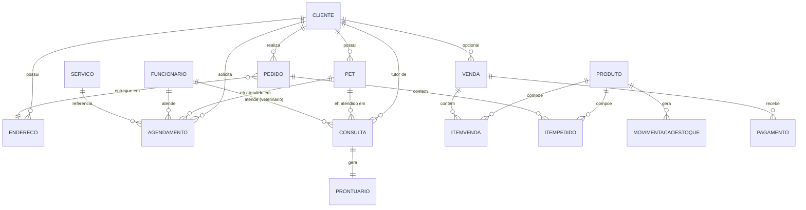

# Petzio ERP — Documentação do Projeto

> **Petshop Hackathon** — Sistema de gestão para pet shops (painel administrativo + portal do cliente)

**Ficha do projeto**

| | |
|---|---|
| Nome do produto | Petzio ERP |
| Nome do desafio/projeto | Petshop Hackathon |
| Tipo | Aplicação web (SPA) — protótipo de interface + especificação de backend |
| Front-end | React 19 + TypeScript + Vite 8 + Tailwind CSS v4 |
| Back-end | Especificado em `API-ROTAS.md` (REST/JSON) — implementação pendente |
| Ambiente de prototipagem | Figma Make |
| Status | Protótipo de interface concluído · especificação de API concluída · backend e testes automatizados pendentes |
| Última atualização | 16/08/2026 |

**Sumário**

1. Prefácio
2. Objetivo do Projeto
3. Delimitação do Problema
4. Descrição Geral do Sistema
5. Descrição do Problema
6. Regras de Negócio
7. Requisitos do Sistema
8. Protótipo
9. Análise e Design
10. Modelo de Dados
11. Implementação
12. Testes
13. Manual do Usuário
14. Conclusões e Considerações Finais
15. Bibliografia

---

## 1. Prefácio

Este documento reúne a documentação técnica e funcional do **Petzio ERP**, sistema desenvolvido no contexto do projeto/desafio **"Petshop Hackathon"**. O objetivo deste README é consolidar em um único lugar tudo o que foi definido sobre o sistema até o momento: o problema que ele resolve, as regras de negócio, os requisitos, o modelo de dados, o estado atual da implementação e um manual de uso — servindo tanto de guia para quem der continuidade ao projeto (em especial à implementação do backend, ainda pendente) quanto de material de apresentação/avaliação.

O sistema foi prototipado na ferramenta **Figma Make**, que gera uma aplicação React funcional a partir do design (não apenas telas estáticas), e teve suas rotas de backend especificadas em detalhe no arquivo `API-ROTAS.md`, documento que serviu de base para grande parte desta documentação.

> *Equipe/autoria: [preencher com o(s) nome(s) do(s) desenvolvedor(es)]*
> *Evento/contexto: Hackathon — Petzio ERP para pet shops*

## 2. Objetivo do Projeto

Desenvolver um sistema web que unifique, em uma única plataforma, a gestão operacional de um pet shop (agenda, vendas, estoque, financeiro, clientes, pets e equipe) com um **portal de autoatendimento para o cliente/tutor**, permitindo que ele agende serviços, acompanhe seus pets e compre produtos pela loja online — eliminando controles manuais e sistemas desconectados (planilhas, agendas de papel, grupos de WhatsApp).

Objetivos específicos:

- Centralizar o cadastro de clientes, pets, produtos e serviços;
- Digitalizar o agendamento de serviços (banho, tosa, consultas veterinárias etc.) com controle de conflito de horário;
- Automatizar o controle de estoque a partir das vendas (PDV) e dos pedidos da loja;
- Consolidar o fluxo financeiro (contas a pagar/receber) gerado pelas operações do dia a dia;
- Oferecer um painel de indicadores (dashboard) e relatórios exportáveis para apoiar decisões;
- Controlar o acesso da equipe por cargo (permissões por módulo);
- Dar ao tutor um canal próprio (portal) para agendar, comprar e acompanhar o histórico dos seus pets.

## 3. Delimitação do Problema

**Está no escopo deste projeto:**

- Painel administrativo completo — 14 módulos: Dashboard, Agenda, Vendas/PDV, Pedidos, Produtos, Estoque, Clientes, Pets, Serviços, Banho e Tosa, Veterinário, Financeiro, Funcionários, Relatórios e Configurações;
- Portal do cliente — 6 áreas: Início, Meus Pets, Agendamento, Loja, Pedidos e Perfil;
- Especificação completa da API REST que sustenta as duas frentes acima (autenticação, papéis, payloads, convenções de resposta);
- Regras de negócio mínimas para consistência de estoque, agenda, permissões e financeiro.

**Está fora do escopo (por ora):**

- Implementação do backend/banco de dados — o projeto entrega a *especificação* das rotas, não o serviço rodando;
- Integração real com gateway de pagamento (PIX/cartão são apenas *formas* registradas, sem processamento efetivo de fato) e com emissão fiscal (NF-e/NFC-e);
- Aplicativo mobile nativo — a interface é web responsiva;
- Logística de entrega/despacho para pedidos "saiu para entrega";
- Multi-loja/franquia — o modelo prevê um campo `petShopId` no usuário, mas não há gestão multi-tenant completa;
- Testes automatizados (ver seção 12).

## 4. Descrição Geral do Sistema

O **Petzio ERP** é uma aplicação web de página única (SPA), construída em **React 19 + TypeScript**, dividida em duas grandes áreas:

- **`/admin/*`** — voltada à equipe do pet shop (administrador, gerente, atendente, caixa, tosador, veterinário), reunindo os módulos operacionais do negócio;
- **`/portal/*`** — voltada ao cliente/tutor autenticado, com uma experiência de autoatendimento (agendar, comprar, acompanhar pets).

O acesso é único (`/`, tela de login) e o redirecionamento pós-login depende do papel (`role`) do usuário: contas com papel `cliente` vão para o portal; as demais vão para o admin.

A comunicação com o servidor segue um padrão REST/JSON com envelope de resposta consistente (`data`/`meta` em sucesso, `error.code`/`error.message` em falha), paginação (`page`/`perPage`/`total`), datas em ISO-8601 e valores monetários em decimal — tudo formalizado em `API-ROTAS.md`.

**Principais funcionalidades por módulo:**

| Módulo | Resumo |
|---|---|
| Dashboard | KPIs do dia/mês, gráfico de faturamento, vendas por categoria, ranking de serviços/produtos, agenda do dia, alerta de estoque baixo |
| Agenda | Agendamento de serviços com verificação de horários disponíveis e status do atendimento |
| Vendas / PDV | Venda balcão com múltiplos itens, descontos e formas de pagamento combinadas |
| Pedidos | Pedidos da loja online, com fluxo de status do recebimento à entrega |
| Produtos | Catálogo com SKU, categoria, custo/venda e estoque mínimo |
| Estoque | Resumo e movimentações (entrada/saída/ajuste/perda) |
| Clientes | Cadastro de tutores com histórico de compras, serviços e agendamentos |
| Pets | Cadastro com histórico unificado (banho, tosa, consulta, vacina, produto, agendamento) |
| Serviços | Catálogo de serviços com duração e preço |
| Banho e Tosa | Fila operacional do dia com fluxo sequencial de status |
| Veterinário | Agenda clínica, consultas/vacinas e prontuário do pet |
| Financeiro | Resumo, fluxo de caixa mensal, contas a pagar/receber |
| Funcionários | Cadastro da equipe e matriz de permissões por cargo × módulo |
| Relatórios | Relatórios por categoria com exportação (PDF/XLSX/CSV) |
| Configurações | Dados do estabelecimento, horário de funcionamento, notificações |
| Portal do cliente | Dashboard próprio, pets, agendamento em 5 passos, loja, pedidos e perfil (endereços e preferências) |

## 5. Descrição do Problema

Pet shops de pequeno e médio porte tipicamente operam com ferramentas fragmentadas: agenda em papel ou planilha, controle de estoque manual (ou inexistente), vendas registradas sem vínculo com o estoque e comunicação com o cliente por telefone/WhatsApp. Isso gera problemas recorrentes que o sistema busca resolver diretamente:

| Problema no dia a dia | Como o sistema resolve |
|---|---|
| Vendas e pedidos não descontam o estoque automaticamente, causando ruptura ou venda de produto inexistente | Toda venda de PDV e todo pedido do portal geram baixa automática de estoque, sem permitir estoque negativo |
| Dois agendamentos para o mesmo profissional no mesmo horário | Endpoint de horários disponíveis + validação de conflito na criação/edição do agendamento |
| Cliente sem visibilidade do histórico de cada pet (banhos, vacinas, consultas) | Histórico unificado por pet, filtrável por tipo de evento |
| Funcionário acessando módulos que não deveria (ex.: tosador vendo o Financeiro) | Matriz de permissões por cargo × módulo, com bloqueio HTTP 403 |
| Contas a receber/pagar controladas fora do sistema (ou não controladas) | Lançamentos financeiros gerados automaticamente a partir de vendas/serviços concluídos, além de lançamentos manuais |
| Cliente precisa ligar para agendar ou comprar | Portal próprio: agendamento guiado em 5 passos e loja com checkout |
| Fila do banho e tosa sem controle de etapas | Status sequencial obrigatório: Agendado → Recepcionado → Em atendimento → Finalizado → Entregue |

## 6. Regras de Negócio

Regras mínimas definidas para o sistema, organizadas por área:

**RN01 — Estoque:** toda venda no PDV e todo pedido feito pelo portal geram baixa (saída) automática de estoque.
**RN02 — Estoque:** o estoque não pode ficar negativo.
**RN03 — Agenda:** antes de confirmar um agendamento, o sistema valida conflito de horário do funcionário e a duração do serviço.
**RN04 — Portal:** todo recurso sob `/portal/*` é filtrado pelo `clienteId` do token de autenticação; um tutor nunca vê dados de outro tutor.
**RN05 — Pedidos:** somente a equipe (admin) altera o status operacional de um pedido; o cliente só cria ou cancela (quando o status atual permitir).
**RN06 — Financeiro:** uma venda ou serviço concluído pode gerar automaticamente uma conta a receber.
**RN07 — Permissões:** o acesso a cada módulo do admin é controlado pela matriz cargo × módulo; acesso não permitido retorna HTTP 403.
**RN08 — Banho e Tosa:** o avanço de status da fila é sequencial; não é permitido pular etapas, exceto por override do administrador.
**RN09 — Autenticação:** login de equipe (admin) e de cliente (portal) podem compartilhar o mesmo endpoint (`POST /auth/login`), diferenciando-se por `contexto` ou pelo papel (`role`) retornado.

**Máquinas de status (fluxos controlados):**

| Fluxo | Sequência de status |
|---|---|
| Agendamento (admin/portal) | Agendado → Confirmado → Em atendimento → Concluído / Cancelado |
| Banho e Tosa (fila) | Agendado → Recepcionado → Em atendimento → Finalizado → Entregue |
| Pedido (loja) | Recebido → Em preparação → Pronto → Saiu para entrega → Entregue / Cancelado |
| Conta a Receber | Pendente → Recebido |
| Conta a Pagar | Pendente → Pago |
| Movimentação de estoque (tipo) | Entrada / Saída / Ajuste / Perda |

## 7. Requisitos do Sistema

### 7.1 Requisitos Funcionais

| Código | Descrição |
|---|---|
| RF01 | Login de funcionários e clientes, com redirecionamento conforme o papel do usuário |
| RF02 | Recuperação e redefinição de senha |
| RF03 | Dashboard com KPIs (vendas do dia, faturamento do mês, agendamentos, clientes ativos, estoque baixo, contas a receber) |
| RF04 | Criar, listar, editar e cancelar agendamentos, com verificação de horários livres |
| RF05 | Cadastro, consulta, edição e inativação de clientes, com histórico de compras, serviços e agendamentos |
| RF06 | Cadastro de pets vinculados a um tutor, com histórico unificado por tipo de evento |
| RF07 | Cadastro e gestão de produtos, com categoria, preço de custo/venda e estoque mínimo |
| RF08 | Registro de movimentações de estoque (entrada, saída, ajuste, perda) e resumo consolidado |
| RF09 | Finalização de vendas no PDV com múltiplos itens, descontos e múltiplas formas de pagamento |
| RF10 | Consulta, avanço de status e cancelamento de pedidos, pelo admin e pelo próprio cliente no portal |
| RF11 | Cadastro e gestão de serviços (nome, duração, preço, status) |
| RF12 | Fila operacional de banho e tosa do dia, com avanço sequencial de status e registro de observações |
| RF13 | Agendamento de consultas/vacinas veterinárias e registro de prontuário clínico do pet |
| RF14 | Resumo financeiro (receita, despesa, lucro, a receber, a pagar) e lançamentos manuais |
| RF15 | Cadastro de funcionários e definição de matriz de permissões por cargo × módulo |
| RF16 | Relatórios por categoria (vendas, financeiro, estoque, produtos, serviços, clientes, pets, funcionários), exportáveis em PDF, XLSX ou CSV |
| RF17 | Configuração dos dados do estabelecimento, horário de funcionamento e preferências de notificação |
| RF18 | Portal com resumo próprio do cliente (próximo agendamento, pets, último pedido) |
| RF19 | Cadastro/edição dos próprios pets pelo cliente, com visualização de histórico |
| RF20 | Fluxo de agendamento guiado em 5 passos (pet → serviço → data/horário → confirmação) |
| RF21 | Loja online com catálogo filtrável (apenas produtos ativos e em estoque) e checkout com endereço e forma de pagamento |
| RF22 | Gestão de perfil, endereços e preferências de notificação pelo cliente |
| RF23 | Upload genérico de imagens (foto de pet, avatar, produto) |
| RF24 | Endpoints de healthcheck e versão da API |

### 7.2 Requisitos Não Funcionais

| Código | Descrição |
|---|---|
| RNF01 | Autenticação via token JWT (Bearer) ou cookie httpOnly |
| RNF02 | Controle de acesso baseado em papel (RBAC): `admin`, `gerente`, `atendente`, `caixa`, `tosador`, `veterinario`, `cliente` |
| RNF03 | Respostas da API em JSON com envelope padronizado (`data`/`meta` ou `error`) |
| RNF04 | Datas em ISO-8601 e valores monetários em decimal |
| RNF05 | Listagens com paginação (`page`, `perPage`, `total`) |
| RNF06 | Interface responsiva (Tailwind CSS utilitário) |
| RNF07 | Front-end em React 19 + TypeScript com checagem estrita de tipos (`strict: true`) |
| RNF08 | Ambiente de desenvolvimento com hot-reload via Vite |
| RNF09 | Recursos sensíveis (dados de outro tutor, módulos fora do cargo) bloqueados no backend, não apenas ocultados na interface |

## 8. Protótipo

O protótipo funcional foi construído na ferramenta **Figma Make**, que converte o design em uma aplicação React real (não apenas telas estáticas), servida por um servidor de desenvolvimento Vite (documentado em `AGENTS.md`).

**Metadados do site do protótipo** (`.figma/make/site.json`):

- Título: *Petshop Hackathon*;
- Indexação por buscadores: desativada (`robots.index: false`) — apropriado para um protótipo em desenvolvimento;
- Links de acessibilidade ("pular para o conteúdo") e `prefers-reduced-motion`: não habilitados na configuração atual.

**Navegação prototipada:**

- Tela pública única: `/` (login);
- 14 telas administrativas sob `/admin/*` (ver tabela da seção 4);
- 6 telas do portal sob `/portal/*` (ver tabela da seção 4).

> Este README não inclui capturas de tela do protótipo. Recomenda-se anexar aqui prints ou um GIF de navegação exportados diretamente do preview do Figma Make para complementar esta seção.

## 9. Análise e Design

### 9.1 Atores do sistema

| Ator | Descrição |
|---|---|
| Administrador | Acesso completo a todos os módulos |
| Gerente | Acesso operacional amplo, conforme matriz de permissões |
| Atendente | Atendimento, agenda, vendas e cadastros |
| Caixa | Foco em vendas/PDV e financeiro |
| Tosador | Fila de banho e tosa |
| Veterinário | Agenda clínica e prontuário |
| Cliente (tutor) | Acesso restrito ao próprio portal (`/portal/*`) |

### 9.2 Principais casos de uso

- **UC01 — Autenticar-se:** funcionário ou cliente informa e-mail/senha; o sistema retorna um token e redireciona conforme o papel.
- **UC02 — Agendar serviço (admin):** atendente escolhe cliente, pet, serviço, funcionário e horário; o sistema valida disponibilidade.
- **UC03 — Agendar serviço (portal):** tutor percorre o fluxo guiado de 5 passos e confirma o agendamento.
- **UC04 — Registrar venda no PDV:** caixa monta a comanda com produtos, aplica descontos, informa forma(s) de pagamento e finaliza, com baixa automática de estoque.
- **UC05 — Processar pedido da loja:** cliente monta o carrinho e finaliza o checkout; a equipe acompanha e avança o status até a entrega.
- **UC06 — Conduzir atendimento de banho e tosa:** tosador avança o pet pela fila (Recepcionado → Em atendimento → Finalizado → Entregue).
- **UC07 — Registrar atendimento veterinário:** veterinário realiza a consulta e grava anamnese, diagnóstico, conduta e vacinas aplicadas no prontuário do pet.
- **UC08 — Gerir financeiro:** equipe consulta o resumo financeiro e lança contas a pagar/receber manuais.
- **UC09 — Administrar permissões:** administrador define quais módulos cada cargo pode acessar.
- **UC10 — Gerar relatório:** gerente escolhe categoria e período e exporta o relatório em PDF/XLSX/CSV.

### 9.3 Arquitetura proposta

```
┌───────────────────────────┐     HTTPS / JSON     ┌───────────────────────────┐
│  Front-end (SPA)           │ ───────────────────▶ │  API REST (a implementar)  │
│  React 19 + TS + Vite 8    │ ◀─────────────────── │  Auth JWT · RBAC por role  │
│  Tailwind CSS v4            │                       │  Recursos /admin e /portal │
│  react-router · recharts    │                       └─────────────┬──────────────┘
└───────────────────────────┘                                       │
                                                                      ▼
                                                          ┌────────────────────────┐
                                                          │      Banco de dados      │
                                                          │       (a definir)        │
                                                          └────────────────────────┘
```

- O front-end é uma SPA única com duas árvores de rotas (`/admin/*` e `/portal/*`) protegidas por autenticação.
- A API segue convenção REST com prefixos por escopo (`/auth`, `/admin/*`, `/portal/*`) e recursos compartilhados (ex.: `/uploads`).
- O controle de acesso deve existir tanto no front-end (ocultar módulos) quanto, obrigatoriamente, no backend (validação real de permissão).

## 10. Modelo de Dados

### 10.1 Entidades principais

| Entidade | Atributos principais |
|---|---|
| **Cliente** | id, nome, telefone, email, cpf, endereços[], observações, status |
| **Endereco** | id, clienteId, rótulo, logradouro, número, complemento, bairro, cidade, uf, cep, principal |
| **Pet** | id, tutorId, nome, espécie, raça, sexo, nascimento, peso, fotoUrl, observações |
| **Funcionario** | id, nome, cargo, telefone, email, status |
| **Produto** | id, nome, sku, códigoBarras, categoria, marca, custo, venda, estoque, estoqueMin, fornecedorId, status |
| **Servico** | id, nome, descrição, duraçãoMinutos, preço, funcionárioPadraoId, status |
| **Agendamento** | id, clienteId, petId, serviçoId, funcionárioId, dataHora, status, observações |
| **Venda** | id, clienteId (opcional), itens[], descontoTotal, pagamentos[], status, criadoEm |
| **ItemVenda** | vendaId, produtoId, quantidade, precoUnitario, desconto |
| **Pagamento** | vendaId, forma, valor |
| **Pedido** | id, clienteId, itens[], enderecoId, formaPagamento, status, observações |
| **ItemPedido** | pedidoId, produtoId, quantidade |
| **MovimentacaoEstoque** | id, produtoId, tipo, quantidade, motivo, criadoEm |
| **Consulta** | id, petId, clienteId, veterinárioId, dataHora, tipo, status, observações |
| **Prontuario** | consultaId, anamnese, diagnóstico, conduta, vacinasAplicadas[] |
| **LancamentoFinanceiro** | id, tipo (receber/pagar), descrição, categoria, valor, vencimento, formaPagamento, status, clienteId (opcional) |
| **Permissao** | cargo, módulo, permitido |

### 10.2 Relacionamentos (visão simplificada)



> Diagrama em sintaxe Mermaid — renderiza automaticamente em visualizadores compatíveis (ex.: GitHub).

## 11. Implementação

### 11.1 Stack tecnológica

| Camada | Tecnologia | Versão (`package.json`) |
|---|---|---|
| UI | React / React DOM | 19.2.8 |
| Roteamento | react-router | 8.3.0 |
| Gráficos | recharts | 3.10.1 |
| Ícones | lucide-react | 1.31.0 |
| Build/dev server | Vite | 8.0.0 |
| Linguagem | TypeScript | 5.7.0 (strict) |
| Estilo | Tailwind CSS | 4.0.0 (via `@tailwindcss/vite`, sem arquivo de config) |
| Plugin React p/ Vite | @vitejs/plugin-react | 6.0.0 |
| Formatação | oxfmt | 0.2.0 |
| Gerenciador de pacotes | pnpm (lockfile presente no projeto) | — |

### 11.2 Estrutura do projeto

```
figma-make-app/
├── src/
│   ├── main.tsx           # entrypoint React; importa index.css e monta App em #root
│   ├── App.tsx             # componente principal / ponto de partida da UI
│   ├── index.css           # entrypoint global + @import 'tailwindcss'
│   ├── routes.ts           # (referenciado em API-ROTAS.md) definição das rotas do front
│   └── pages/**              # (referenciado em API-ROTAS.md) telas admin/ e portal/
├── index.html               # shell HTML servido pelo Vite, com slots preenchidos em build
├── vite.config.ts           # config Vite + plugins Figma Make (ver 11.3)
├── tsconfig.json            # target ES2020, strict, alias @/* → ./src/*
├── package.json             # scripts (dev/build/preview/format) e dependências
├── .mise.toml                 # versões de Node.js/pnpm (não incluído nesta documentação)
└── .figma/make/site.json      # metadados do site (título, robots, acessibilidade)
```

### 11.3 Plugins Vite customizados (Figma Make)

- **figmaSiteConfiguration** — injeta os dados de `site.json` no `index.html` (título, descrição, meta robots, Open Graph, Google Analytics) e serve `robots.txt` quando a indexação está desativada.
- **figmaErrorOverlayReplay** *(dev)* — reencaminha o último erro de build/HMR para conexões novas, evitando que o overlay de erro "suma" após um reload do preview.
- **figmaReactRefreshBoundaryFallback** *(dev)* — força um full-reload quando um módulo deixa de ser um boundary de HMR (ex.: virou um re-export), evitando árvore React desatualizada em tela.
- **figmaMakeKitPlugin** *(dev)* — serve `/.figma/make/kit.html`, página que registra todos os arquivos `*.stories.*` para o painel de design do Figma montar dinamicamente.

### 11.4 Padrões de código (conforme `AGENTS.md`)

- Aspas duplas em strings com apóstrofo (ex.: `"We're here to help"`), para não quebrar o build;
- Tags JSX sempre fechadas e chaves balanceadas;
- Componentes exportados como `export default`;
- Customização de tema Tailwind e `@font-face` centralizadas em `src/index.css`.

### 11.5 Estado atual da implementação

- ✅ Scaffold do projeto (Vite + React + TS + Tailwind v4) configurado e funcional;
- ✅ Especificação completa da API (`API-ROTAS.md`), com rotas, payloads, papéis e regras de negócio;
- ⏳ Telas (`src/App.tsx`, `src/pages/**`, `src/routes.ts`) em desenvolvimento no Figma Make — não incluídas nesta rodada de documentação;
- ⏳ Backend/banco de dados: não implementado — apenas especificado.

## 12. Testes

### 12.1 Status atual

Não há, até o momento, suíte de testes automatizados no projeto: `package.json` não lista bibliotecas de teste (ex.: Vitest, Jest, Testing Library, Playwright/Cypress). A validação atual é feita manualmente pelo preview interativo do Figma Make.

### 12.2 Estratégia de testes recomendada

| Nível | Ferramenta sugerida | Foco |
|---|---|---|
| Unitário | Vitest + React Testing Library | Componentes de UI e funções puras (cálculo de troco, formatação de moeda/data) |
| Integração | Vitest + MSW (mock de API) | Fluxos que dependem de múltiplos endpoints (ex.: checkout do portal) |
| Ponta a ponta (E2E) | Playwright ou Cypress | Jornadas completas: login → agendamento → PDV → checkout do portal |
| Contrato de API | Testes de contrato contra `API-ROTAS.md` | Garantir que o backend implementado respeita o envelope `data`/`meta`/`error` |

### 12.3 Roteiro de testes manuais (smoke test) sugerido

1. Login com contexto `admin` e com contexto `portal`, validando o redirecionamento correto.
2. Criar um agendamento em horário já ocupado e confirmar que o sistema bloqueia o conflito.
3. Finalizar uma venda no PDV e conferir a baixa automática no módulo Estoque.
4. Realizar um checkout na Loja do portal e acompanhar a mudança de status em Pedidos (admin).
5. Avançar um atendimento na fila de Banho e Tosa fora de ordem e confirmar o bloqueio (exceto com override de admin).
6. Acessar, com um cargo sem permissão (ex.: Tosador), o módulo Financeiro e confirmar o retorno `403`.
7. Tentar acessar, pelo portal, dados de um pet que não pertence ao tutor logado e confirmar o bloqueio.

## 13. Manual do Usuário

### 13.1 Acesso ao sistema

Acesse a tela inicial (`/`) e informe e-mail e senha. O sistema identifica automaticamente se a conta é de um **funcionário** (leva ao painel administrativo) ou de um **cliente** (leva ao portal). Em caso de esquecimento de senha, use "Esqueci minha senha" para receber o link de redefinição.

### 13.2 Painel Administrativo (equipe do pet shop)

| Onde | O que fazer |
|---|---|
| **Dashboard** | Acompanhe vendas do dia, faturamento do mês, agendamentos, alertas de estoque baixo e contas a receber próximas do vencimento. |
| **Agenda** | Visualize por dia/semana/mês; crie um agendamento escolhendo cliente, pet, serviço, profissional e horário; atualize o status conforme o atendimento avança. |
| **Vendas / PDV** | Monte a comanda adicionando produtos, aplique descontos se necessário, escolha uma ou mais formas de pagamento e finalize a venda. |
| **Pedidos** | Acompanhe os pedidos feitos pela loja do portal e avance o status até "Entregue". |
| **Produtos** | Cadastre produtos com SKU, categoria, preços de custo/venda e estoque mínimo; ative/inative conforme necessário. |
| **Estoque** | Consulte o resumo (total, produtos com estoque baixo/zerado, valor em estoque) e registre entradas, saídas, ajustes ou perdas manuais. |
| **Clientes** | Cadastre tutores e consulte o histórico de compras, serviços e agendamentos de cada um. |
| **Pets** | Cadastre pets vinculados a um tutor e consulte o histórico unificado (banhos, tosas, consultas, vacinas, produtos, agendamentos). |
| **Serviços** | Cadastre os serviços oferecidos, com duração e preço, para uso na Agenda e no portal. |
| **Banho e Tosa** | Acompanhe a fila do dia e avance cada pet pelas etapas (Recepcionado → Em atendimento → Finalizado → Entregue), registrando observações. |
| **Veterinário** | Consulte a agenda clínica, registre consultas/vacinas e preencha o prontuário (anamnese, diagnóstico, conduta, vacinas aplicadas). |
| **Financeiro** | Acompanhe receita, despesas, lucro e o fluxo mensal; gerencie contas a pagar e a receber, incluindo lançamentos manuais. |
| **Funcionários** | Cadastre a equipe e defina, na matriz de permissões, quais módulos cada cargo pode acessar. |
| **Relatórios** | Escolha uma categoria e um período para visualizar gráficos/tabelas e exportar em PDF, XLSX ou CSV. |
| **Configurações** | Atualize os dados do estabelecimento, horário de funcionamento e preferências de notificação. |

### 13.3 Portal do Cliente (tutor)

| Onde | O que fazer |
|---|---|
| **Início** | Veja um resumo: próximo agendamento, quantidade de pets cadastrados, último pedido e serviços recentes. |
| **Meus Pets** | Cadastre e edite seus pets; consulte o histórico e os agendamentos de cada um. |
| **Agendamento** | Siga o fluxo guiado em 5 passos: escolha o pet, o serviço, a data/horário disponível e confirme (revisando pet, serviço, data, horário e valor). |
| **Loja** | Navegue pelo catálogo de produtos (apenas itens ativos e com estoque), filtre por categoria e finalize a compra informando endereço e forma de pagamento. |
| **Pedidos** | Acompanhe o status dos seus pedidos e cancele quando permitido. |
| **Perfil** | Atualize seus dados pessoais, gerencie endereços (marcando um como principal) e ajuste preferências de notificação e senha. |

## 14. Conclusões e Considerações Finais

O projeto **Petzio ERP** consolidou, nesta fase, dois entregáveis centrais: um **protótipo de interface funcional** (gerado no Figma Make, cobrindo as 14 telas administrativas e as 6 telas do portal) e uma **especificação de backend completa e detalhada** (`API-ROTAS.md`), cobrindo autenticação, 23 grupos de rotas, regras de negócio mínimas e uma ordem de prioridade sugerida para implementação.

O maior valor desta etapa está em ter mapeado, a partir das telas do protótipo, todo o contrato de dados necessário para o backend, reduzindo ambiguidade para quem for implementá-lo. As regras de negócio explicitadas (controle de estoque, conflito de agenda, isolamento de dados do portal por cliente, permissões por cargo, geração automática de contas a receber e fluxo sequencial do banho e tosa) formam a espinha dorsal da consistência do sistema.

**Limitações atuais e próximos passos:**

- Implementar o backend (API + banco de dados) seguindo a especificação e a ordem de prioridade sugerida em `API-ROTAS.md` (Auth → Clientes/Pets/Produtos/Serviços → Agendamentos → Vendas/Estoque → Pedidos → Banho e Tosa/Veterinário → Financeiro → Dashboard/Relatórios → Funcionários/Permissões/Configurações);
- Construir a suíte de testes automatizados (ver seção 12);
- Avaliar integração real com meio de pagamento (PIX/cartão) e emissão fiscal, hoje fora do escopo;
- Incluir capturas de tela/GIF do protótipo nesta documentação;
- Definir e documentar o banco de dados físico (hoje o modelo de dados é lógico, derivado dos payloads da API).

## 15. Bibliografia

- REACT. **Documentação oficial.** Disponível em: https://react.dev
- VITE. **Documentação oficial.** Disponível em: https://vitejs.dev
- TYPESCRIPT. **Documentação oficial.** Disponível em: https://www.typescriptlang.org/docs
- TAILWIND CSS. **Documentação oficial (v4).** Disponível em: https://tailwindcss.com/docs
- REACT ROUTER. **Documentação oficial.** Disponível em: https://reactrouter.com
- RECHARTS. **Documentação oficial.** Disponível em: https://recharts.org
- JONES, M.; BRADLEY, J.; SAKIMURA, N. **JSON Web Token (JWT).** RFC 7519, IETF, 2015. Disponível em: https://datatracker.ietf.org/doc/html/rfc7519
- INTERNATIONAL ORGANIZATION FOR STANDARDIZATION. **ISO 8601 — Date elements and interchange formats.**
- FIELDING, R. T. **Architectural Styles and the Design of Network-based Software Architectures.** Tese de doutorado — University of California, Irvine, 2000.
- FIGMA. **Figma Make — Documentação oficial.** Disponível em: https://www.figma.com/make

---

*Documento gerado a partir dos arquivos do projeto (`AGENTS.md`, `API-ROTAS.md`, `vite.config.ts`, `package.json`, `tsconfig.json`, `index.html`, `site.json`). Última atualização: 16/08/2026.*
